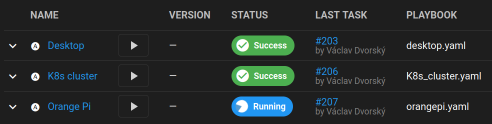

= Little-IaC Ansible scripts
Václav Dvorský <hufhendr@gmail.com>
1.1, 25 April, 2022: Ansible readme
:toc:
:icons: font
:url-quickref: https://github.com/hufhend/Little-IaC

Recently, I was intrigued by the idea that it is possible to use Ansible to manage real computers similar
to the services in Kubernetes. That is, to achieve such a degree of automation that we can replace a burnt
computer with another one and give it the same settings relatively quickly via Ansible.

This small project builds on these principles and strongly integrates DevOps approaches of infrastructure
as code.

WARNING: The intended use is on a new bare metal installation of Linux, deployment on already running machines could be problematic.

== Quick Start

* First we clone the repository
+
`+git clone git@github.com:hufhend/Little-IaC.git+`

* All playbooks and roles are relative is the root directory _ansible_, we enter it.
+
`+cd Little-IaC+`

* Copy the sample variables, modify them as needed
+
`+cp -rfp sample/* .+`

* And simply run the first playbook
+
`+ansible-playbook -i inventory.yaml -l desktop setup.yaml+`

If you end up with an error, it is most likely caused by a non-existent user for Ansible. Read on for a first launch.

TIP: I recommend to try the functions in a non-production environment, for example via Vagrant.

== First launch
Before the first launch, we need to assign a new computer and user to run Ansible. A special playbook and roles are used for this.

=== Playbook host_init
After a clean Linux installation, we usually have one regular user with sudo privileges. This is usually enough for us to manage the system from the command line, but for Ansible we need additional settings.
The host_init role sets the default user to run Ansible, uploads the ssh keys, adds it to sudoers, and sets the hostname.

Before you run it, check and edit the user name for Ansible according to your preferences. The default is _hufhendr_ and it is in the files:

* inventory.yaml
* group_vars/all/user_ansible.yaml
* host-init.yaml

The bare minimum of changes is to set your user in the file host-init.yaml

==== Usage

`+ansible-playbook -i inventory.yaml -l desktop host-init.yaml -kK+`

== Features of playbooks

=== Desktop

The goal of this playbook is to turn a regular Ubuntu for desktop or laptop into a much better tuned system. At the same time connected to IAC automation and more manageable remotely.

The playbook is simple and easy to read.

Usage:

`+ansible-playbook -i inventory.yaml -l notebook desktop.yaml+`

=== Kubernetes node

The goal of the playbook is to make a regular Ubuntu installation into a Kubernetes-ready system. For laptops, it disables all sleep sensors. It will install and set up keepalived for HA under the cluster for bare metal installation. Adds crontabs for updating. Optionally sets up a firewall.

This playbook can be combined with the desktop playbook.

Usage:

`+ansible-playbook -i inventory.yaml -l notebook K8s_cluster.yaml+`

== Detailed description

.Common parameters
|===
|Name |Description|Default value

|`+docker_user+`
|user for the docker role
|`+ansible_user+`

|`+role+`
|node role in the cluster: master or worker
|`+computer+`

|`+firewall+`
|decides whether to turn on the firewall
|`+false+`

|`+desktop+`
|determines if the computer is used by a human
|`+false+`

|`+cron+`
|enables crontab setting at K8s value
|`+choose+`

|`+orange+`
|enabling roles for ARM single board computers
|`+false+`

|===

The default setting of the _comuter_ role causes tasks from the cluster_node to not be executed. The required value should be set in host_vars.

.Docker app parameters
|===
|Name |Description|Default value

|`+docker_home+`
|directory for Docker applications
|`+docker+`

|`+gitea+`
|deploy the app gitea
|`+false+`

|`+pihole+`
|deploy the app pi-hole
|`+false+`

|`+prometheus+`
|deploy the app prometheus
|`+false+`

|===

=== Firewall role

Firewall rules were originally designed very simply and disabled by default. Later it started to evolve and add more functionality. Currently it can generate rules for a Kubernetes cluster node depending on its usage.

I followed the documentation, first by enabling known ports and then by analyzing the logs and resolving the residual blocked traffic - that's where I used ChatGPT.

The major breakthrough was enabling East-West traffic, which I leave in Calico's management.

.Firewall variables
|===
|Name |Description|Default value

|`+safe_network+`
|internal protected network
|`+192.168.88.0/24+`

|`+kube_network+`
|Kubernetes internal network
|`+10.10.0.0/16+`

|`+port+`
|destination port
|

|`+proto+`
|TCP/IP protocol
|`+tcp+`

|`+from, src+`
|source IP address
|`+any+`

|`+route+`
|apply the rule to routed/forwarded packets
|`+false+`

|`+comment+`
|add a comment to the rule
|

|===

_Firewall is not a separately executable role, it's just an engine. You can find the rules setup in the link:roles/cluster_node/vars/main.yml[cluster node] role._

== Free Software, Paid Support

This project is free and open-source software, provided “as is” in accordance with the GNU GPL license. You are free to use, study, modify, and distribute it under the terms of this license.

However, free software does not mean you cannot pay for it—and for many users and companies, it makes sense to pay for expert assistance, peace of mind, and further development.

That is why I offer paid technical support in the form of a subscription that goes beyond what the license itself provides. This service is intended for those who want:

* certainty and priority in troubleshooting,
* consultations on deployment, configuration, or expansion,
* custom development—that is, advancing the project in a direction that is important to you,
* and long-term collaboration on project development.

== Newly added features
20 Mar 2016

* Support for Red Hat Linux has been added, primarily through the ToolBox project. The goal of the exercise was to prepare for deploying Linux as a jump server / ToolBox in air-gapped environments with restricted access, including support for logging into an Active Directory domain, group synchronization, and a set of tools for managing OpenShift environments. At the same time, the role of cloud tools has been significantly expanded.

_To be continued_

